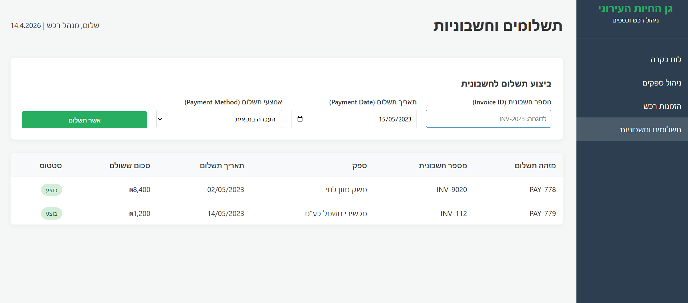
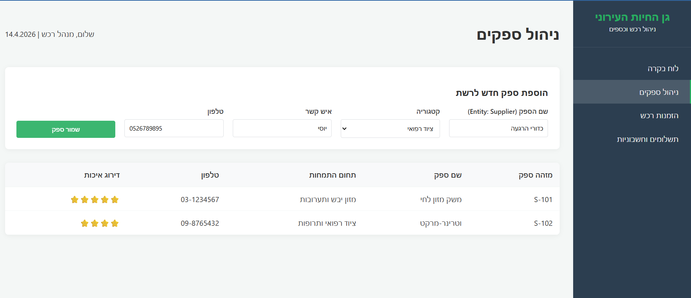
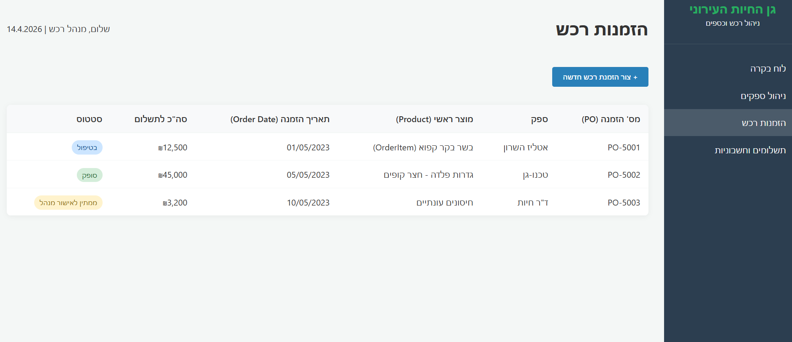
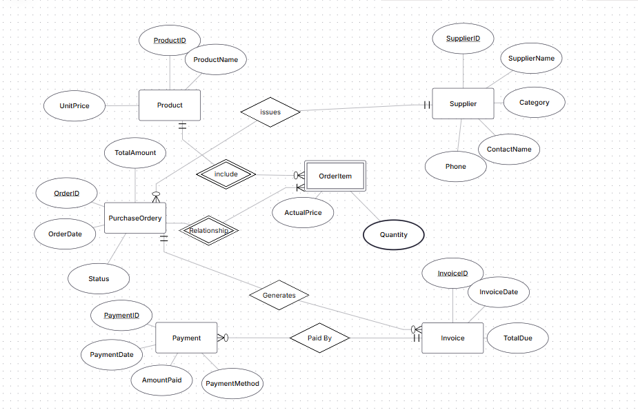
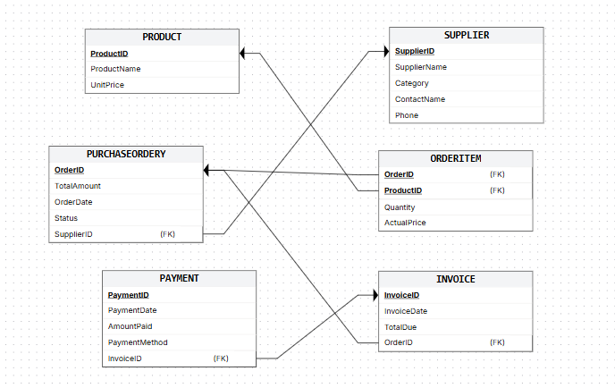
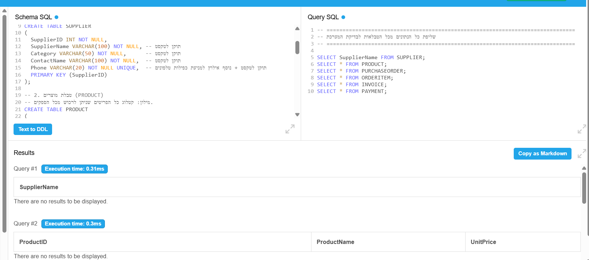
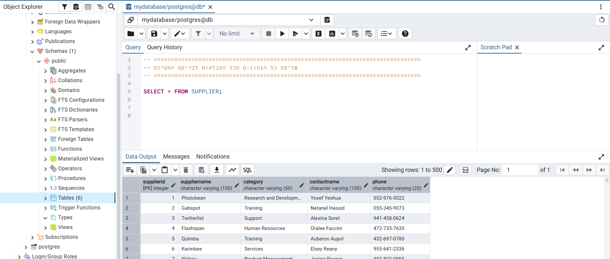
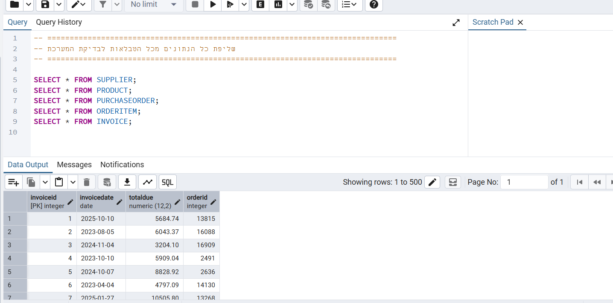

# פרויקט בסיסי נתונים: מערכת ניהול גן חיות 🦁
## אגף ניהול ורכש (Finance & Procurement)

**מגישים:**
* 331145425 - נתנאל חסיד
* יוסף ישועה - 326733706
---

## תוכן עניינים
1. [מבוא](#מבוא)
2. [אפיון מסכים](#אפיון-מסכים)
3. [עיצוב בסיס הנתונים (ERD ו-DSD)](#עיצוב-בסיס-הנתונים)
4. [יצירת בסיס הנתונים](#יצירת-בסיס-הנתונים)
5. [אכלוס נתונים](#אכלוס-נתונים)
6. [גיבוי ושחזור](#גיבוי-ושחזור)

---

## 1. מבוא
המערכת שלנו נועדה לנהל את שרשרת האספקה וההתנהלות הפיננסית של גן החיות. המודל שומר נתונים אודות ספקים (Suppliers), קטלוג פריטים (Products), הזמנות רכש (Purchase Orders), שורות הזמנה (Order Items), חשבוניות (Invoices) ותשלומים (Payments). 
הפונקציונליות העיקרית במערכת מאפשרת לעקוב אחר תהליך הרכש במלואו: משלב פתיחת ההזמנה מול הספק, דרך קבלת החשבונית ועד לביצוע התשלום בפועל, תוך שמירה על שלמות הנתונים ואילוצי המערכת.

---

## 2. אפיון מסכים
נעזרנו ב-Google AI Studio כדי לאפיין 4 מסכים מרכזיים שמכסים את התהליך העסקי של אגף הרכש: לוח בקרה, ניהול ספקים, הזמנות רכש ותשלומים.
* [קישור לדף ה-HTML האינטראקטיבי של אפיון המסכים](zoo.html)

---

## 3. עיצוב בסיס הנתונים
עיצוב בסיס הנתונים בוצע בגישת Top-Down ומוצג בתרשימים הבאים (מנורמל ל-3NF).
הקפדנו על שימוש בישות חלשה (שורת הזמנה) ליצירת מפתח ראשי מורכב.

**תרשים ERD לוגי:**

**תרשים טבלאות (DSD / Relational Schema):**

---

## 4. יצירת בסיס הנתונים
יצרנו את התשתית ב-SQL עם טיפוסי נתונים מדויקים (כולל 2 שדות DATE משמעותיים: `OrderDate` ו-`PaymentDate`) ושילבנו אילוצי `CHECK` ו-`UNIQUE` תואמי מציאות.

---

## 5. אכלוס נתונים
ביצענו אכלוס של הנתונים באמצעות 3 שיטות שונות:
1. **Mockaroo:** שימש ליצירת 500 רשומות לטבלאות הספקים, המוצרים והחשבוניות.
2. **פקודות INSERT פנימיות:** קובץ שיצרנו המכיל 500 פקודות הכנסה לטבלת התשלומים.
3. **סקריפט Python:** יצרנו סקריפט מותאם אישית שייצר מעל 20,000 הזמנות רכש ושורות הזמנה.

---

## 6. שאילות SQL

