# דוח פרויקט - שלב ב'

בשלב זה אנו מבצעים תשאול של מודל הנתונים שבנינו, על מנת להפיק ממנו מידע משמעותי ולא טריוויאלי. כמו כן אנו מדגימים שימוש בטרנזקציות ויצירת אינדקסים ואילוצים במטרה להגן על הנתונים ולייעל את השליפה בחסות האפיון החזותי שתיעדנו.

## תוכן עניינים
* [תשאול נתונים (SELECT)](#תשאול-נתונים-select)
  * [א' - 4 שאילתות בשתי תצורות כתיבה (השוואת יעילות)](#א---4-שאילתות-בשתי-תצורות-כתיבה-השוואת-יעילות)
  * [ב' - 4 שאילתות מורכבות נוספות (תצורה יחידה)](#ב---4-שאילתות-מורכבות-נוספות-תצורה-יחידה)
* [עדכון הנתונים בעומק (UPDATE ו-DELETE)](#עדכון-הנתונים-בעומק-update-ו-delete)
  * [שאילתות UPDATE](#שאילתות-update)
  * [שאילתות DELETE](#שאילתות-delete)
* [אילוצים (Constraints)](#אילוצים-constraints)
* [אינדקסים ובדיקת זמני ריצה](#אינדקסים-ובדיקת-זמני-ריצה)
* [טרנזקציות: ROLLBACK לעומת COMMIT](#טרנזקציות-rollback-לעומת-commit)
  * [טעות הרסנית ופעולת הצלה (ROLLBACK)](#טעות-הרסנית-ופעולת-הצלה-rollback)
  * [עדכון תקין ואישור סופי (COMMIT)](#עדכון-תקין-ואישור-סופי-commit)

---

## תשאול נתונים (SELECT)

### א' - 4 שאילתות בשתי תצורות כתיבה (השוואת יעילות)

#### שאילתה 1: "ספקים מובילים (הוצאה שנתית מעל 50,000)"
**תיאור השאילתא:** מציאת ספקים שהוצאנו מולם למעלה מ-50,000 דולר במהלך שנת 2024. השאילתה מסכמת סכומים ומציגה מידע שלא נגיש ישירות מהטבלאות.

**קוד תצורה א' (JOIN ו-HAVING):**
```sql
SELECT s.SupplierName, s.ContactName, SUM(p.TotalAmount) AS TotalSpent
FROM SUPPLIER s
JOIN PURCHASEORDER p ON s.SupplierID = p.SupplierID
WHERE EXTRACT(YEAR FROM p.OrderDate) = 2024
GROUP BY s.SupplierName, s.ContactName
HAVING SUM(p.TotalAmount) > 50000
ORDER BY TotalSpent DESC;
```
**קוד תצורה ב' (תת-שאילתה מקושרת - IN):**
```sql
SELECT s.SupplierName, s.ContactName, 
       (SELECT SUM(TotalAmount) FROM PURCHASEORDER WHERE SupplierID = s.SupplierID AND EXTRACT(YEAR FROM OrderDate) = 2024) AS TotalSpent
FROM SUPPLIER s
WHERE s.SupplierID IN (
    SELECT SupplierID FROM PURCHASEORDER 
    WHERE EXTRACT(YEAR FROM OrderDate) = 2024
    GROUP BY SupplierID HAVING SUM(TotalAmount) > 50000
)
ORDER BY TotalSpent DESC;
```

##### הרצת שאילתה 1 - תצורה א':
* 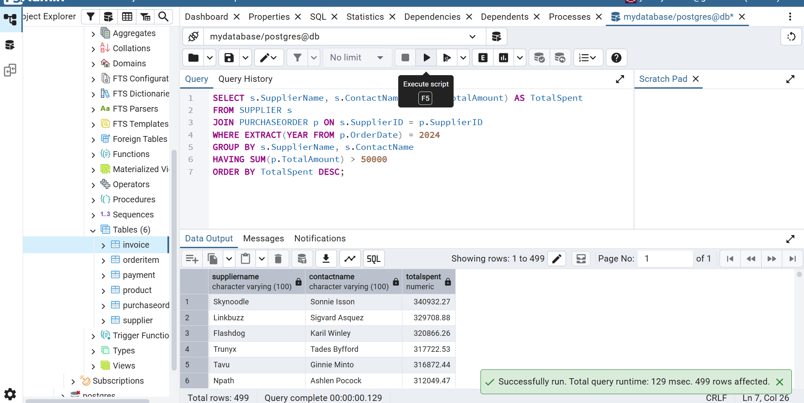

##### הרצת שאילתה 1 - תצורה ב' (תוצאה זהה):
* 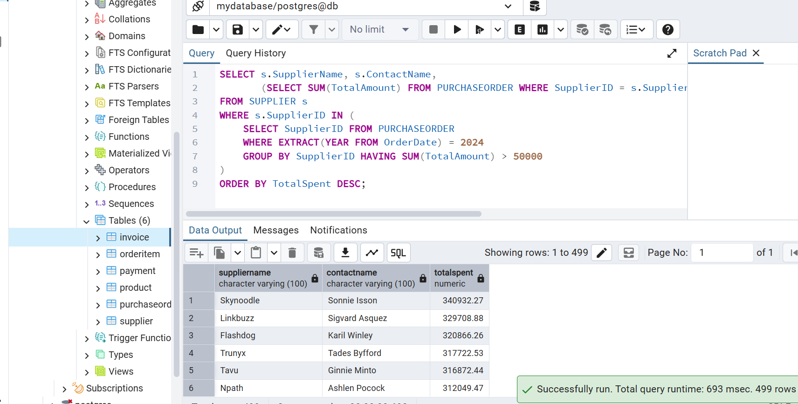


**הבדלי יעילות:** תצורה א' (JOIN + GROUP BY) הינה היעילה ביותר; שרת ה-SQL מבצע את פקודות ה-Hash Join והחישוב (ה-Aggregation) מידית עבור המשתתפים. בתצורה ב', התת-שאילתה רצה באופן מסורבל, והפילטור על בסיס `IN` מקשה משמעותית על חשיבת מנוע הפוסטגרס המחייבת סריקות חוזרות כבדות.

#### שאילתה 2: "ספקים רדומים"
**תיאור השאילתא:** מציאת ספקים שלא ביצענו מולם אף הזמנה בשנת 2025.

**קוד תצורה א' (שימוש ב-NOT IN):**
```sql
SELECT SupplierID, SupplierName, Phone 
FROM SUPPLIER 
WHERE SupplierID NOT IN (
    SELECT SupplierID FROM PURCHASEORDER WHERE EXTRACT(YEAR FROM OrderDate) = 2025
);
```
**קוד תצורה ב' (שימוש ב-LEFT JOIN ו-IS NULL):**
```sql
SELECT s.SupplierID, s.SupplierName, s.Phone 
FROM SUPPLIER s
LEFT JOIN PURCHASEORDER p ON s.SupplierID = p.SupplierID AND EXTRACT(YEAR FROM p.OrderDate) = 2025
WHERE p.OrderID IS NULL;
```


##### הרצת שאילתה 2 - תצורה א':
* 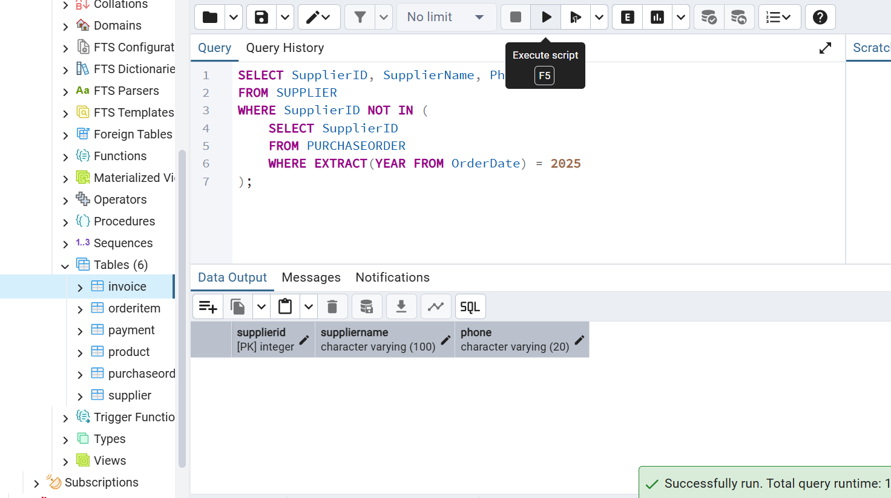

##### הרצת שאילתה 2 - תצורה ב' (תוצאה זהה):
* 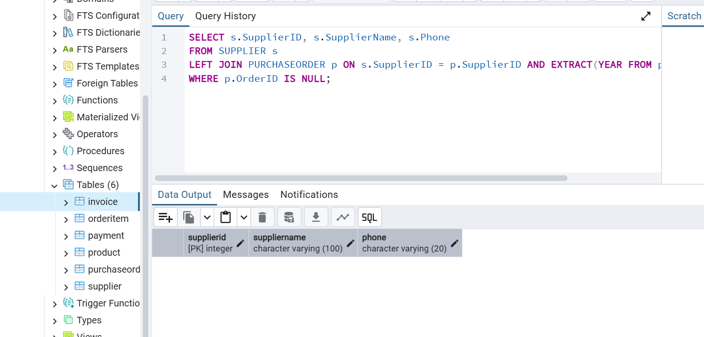


**הבדלי יעילות:** גרסה ב' (`LEFT JOIN` יחד עם פסילת ערכים ב-`IS NULL`, המושג Anti-Join) נחשבת לשיטה היעילה והמומלצת בהרבה למציאת היעדרויות, השרת מאפטם זאת היטב! גרסה א' (NOT IN) קלה יותר לקריאה בעין אנושית אולם עלולה להיות פחות יעילה במיוחד כשנכנסים ערכי `NULL` בחיתוכים.

#### שאילתה 3: "חשבוניות עם חוב פתוח"
**תיאור השאילתא:** שאילתה שמציגה נתונים חשבונאיים מתקדמים: התרעה על כל החשבוניות שסכום התשלומים שנאסף למענן לא מכסה את סכום החשבונית המקורי (הפרשים חיוביים לחוב).

**קוד תצורה א' (GROUP BY ו-COALESCE עם LEFT JOIN):**
```sql
SELECT i.InvoiceID, i.InvoiceDate, i.TotalDue, 
       COALESCE(SUM(p.AmountPaid), 0) AS PaidAmount, 
       (i.TotalDue - COALESCE(SUM(p.AmountPaid), 0)) AS Debt
FROM INVOICE i
LEFT JOIN PAYMENT p ON i.InvoiceID = p.InvoiceID
GROUP BY i.InvoiceID, i.InvoiceDate, i.TotalDue
HAVING (i.TotalDue - COALESCE(SUM(p.AmountPaid), 0)) > 0
ORDER BY Debt DESC;
```
**קוד תצורה ב' (Correlated Subqueries - תת שאילתה מקושרת ב-WHERE):**
```sql
SELECT i.InvoiceID, i.InvoiceDate, i.TotalDue,
       (SELECT COALESCE(SUM(AmountPaid), 0) FROM PAYMENT WHERE InvoiceID = i.InvoiceID) AS PaidAmount,
       (i.TotalDue - (SELECT COALESCE(SUM(AmountPaid), 0) FROM PAYMENT WHERE InvoiceID = i.InvoiceID)) AS Debt
FROM INVOICE i
WHERE i.TotalDue > (SELECT COALESCE(SUM(AmountPaid), 0) FROM PAYMENT WHERE InvoiceID = i.InvoiceID)
ORDER BY Debt DESC;
```


##### הרצת שאילתה 3 - תצורה א':
* 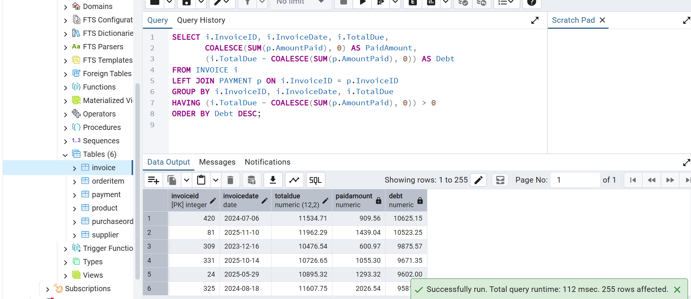

##### הרצת שאילתה 3 - תצורה ב' (תוצאה זהה):
* 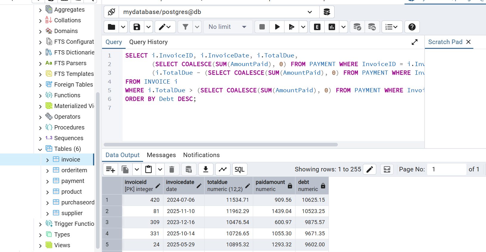

**הבדלי יעילות:** תצורה א' מבצעת חיבור מרוכז (JOIN). מרווחי השליפה יוצרים מפה אחת שעליה מנוע המסד רוכב ומבצע רצף אגרסיוני יעיל. בתצורה ב', התת-שאילתות שב-SELECT וב-WHERE מקושרות, כלומר הן רצות מחדש (הלוך חזור על בסיס משתנה אינדקס i.InvoiceID) עבור *כל שורה ושורה* בכרטיסיות החשבוניות. זו כתיבה איטית באופן תהומי.

#### שאילתה 4: "מוצרי פרימיום מבוקשים"
**תיאור השאילתא:** הצגת פריטי יוקרה מקטלוג ששמם כולל את המילה 'Premium', שמחירם גבוה מהמחיר הממוצע בסורק, ושהוזמנו בכמויות של מעל 500 יחידות בסך הכל היסטורית.

**קוד תצורה א' (JOIN ו-HAVING עם תת-שאילתה בודדת):**
```sql
SELECT pr.ProductName, MAX(pr.UnitPrice) AS CurrentPrice, SUM(oi.Quantity) AS TotalOrdered
FROM PRODUCT pr
JOIN ORDERITEM oi ON pr.ProductID = oi.ProductID
WHERE pr.ProductName LIKE '%Premium%' 
  AND pr.UnitPrice > (SELECT AVG(UnitPrice) FROM PRODUCT)
GROUP BY pr.ProductName
HAVING SUM(oi.Quantity) > 500
ORDER BY TotalOrdered DESC;
```
**קוד תצורה ב' (Inline View - שימוש בטבלה זמנית בתוך ה-FROM):**
```sql
SELECT pr.ProductName, pr.UnitPrice AS CurrentPrice, Aggregated.TotalQty
FROM PRODUCT pr
JOIN (
    SELECT ProductID, SUM(Quantity) AS TotalQty
    FROM ORDERITEM
    GROUP BY ProductID
    HAVING SUM(Quantity) > 500
) Aggregated ON pr.ProductID = Aggregated.ProductID
WHERE pr.ProductName LIKE '%Premium%'
  AND pr.UnitPrice > (SELECT AVG(UnitPrice) FROM PRODUCT)
ORDER BY Aggregated.TotalQty DESC;
```


##### הרצת שאילתה 4 - תצורה א':
* 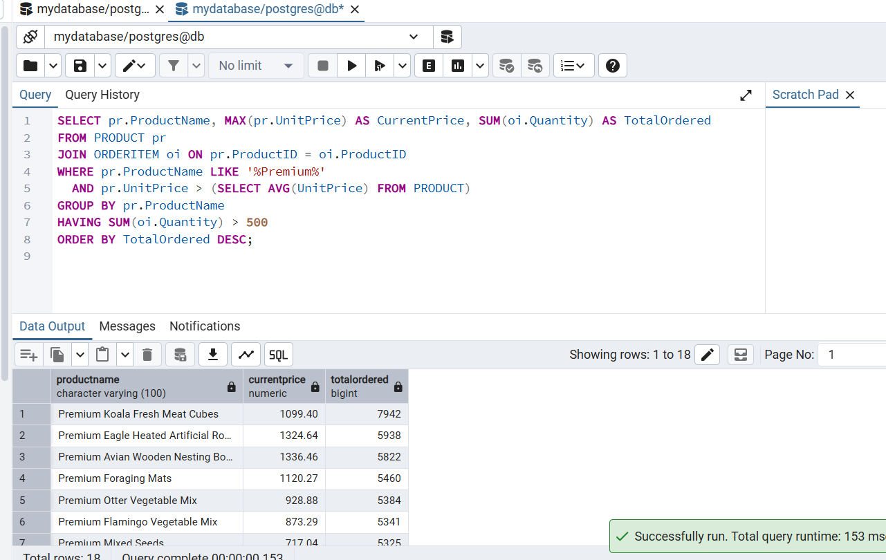

##### הרצת שאילתה 4 - תצורה ב' (תוצאה זהה):
* 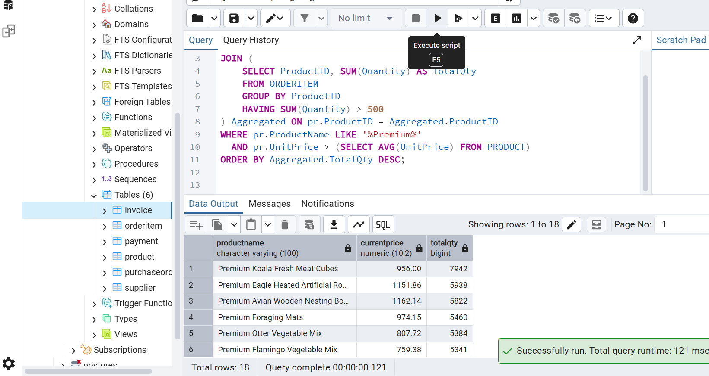


**הבדלי יעילות:** תלוי באילוצי שרת הזיכרון, אך לעיתים קרובות Inline View (תצורה ב') עשויה לקבל יתרון מפלט בשאילתות ענק, מכיוון שאנו כופים על המערכת לצמצם (Aggregate) תחילה את שורות ה-ORDERITEM בנפרד טרם חיבור (JOIN) הענק לטבלאות קטלוג המוצרים, וזה מרוקן עומסים מכמות המידע שנשמרת על הכוונת בזיכרון.

---

### ב' - 4 שאילתות מורכבות נוספות (תצורה יחידה)

#### שאילתה 5: "דוח סיכום רכש חודשי"
**תיאור השאילתא:** מציג באופן מנותח להנהלה כמה הזמנות ומה סך ההוצאה לכל חודש ושנה בנפרד (שימוש בפונקציות תאריכים מרובות).
```sql
SELECT EXTRACT(YEAR FROM OrderDate) AS OrderYear, 
       EXTRACT(MONTH FROM OrderDate) AS OrderMonth, 
       COUNT(OrderID) AS TotalOrders, 
       SUM(TotalAmount) AS MonthlySpend
FROM PURCHASEORDER
GROUP BY EXTRACT(YEAR FROM OrderDate), EXTRACT(MONTH FROM OrderDate)
ORDER BY OrderYear DESC, OrderMonth DESC;
```

* 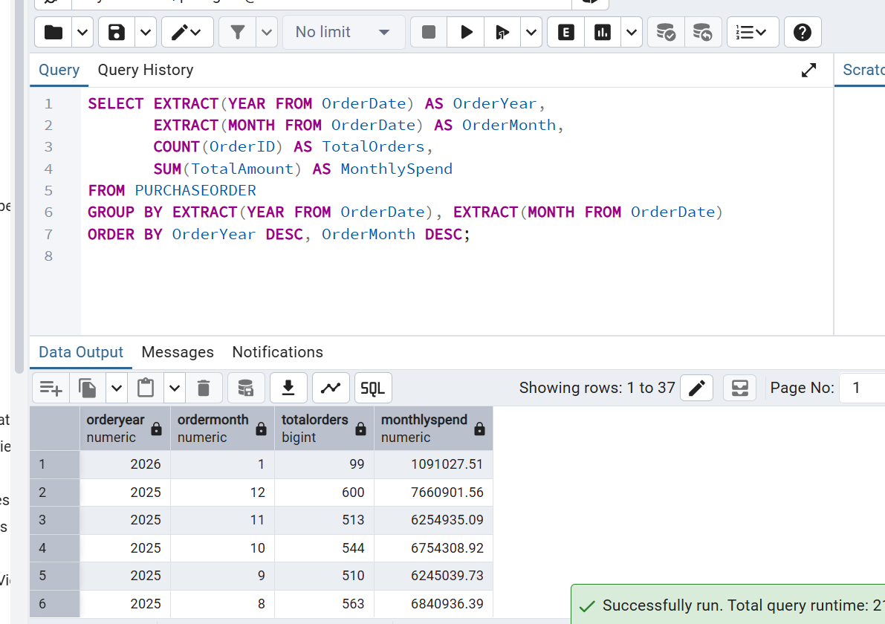


#### שאילתה 6: "פירוט שרשרת אספקה ענק"
**תיאור השאילתא:** צירוף של 4 טבלאות שונות לחשיפה ופירוט מלא של הזמנות בסכום מעל 20,000, כולל שמות הספקים והמוצרים מהעבר.
```sql
SELECT po.OrderID, po.OrderDate, s.SupplierName, pr.ProductName, oi.Quantity, oi.ActualPrice, 
       (oi.Quantity * oi.ActualPrice) AS LineTotal
FROM PURCHASEORDER po
JOIN SUPPLIER s ON po.SupplierID = s.SupplierID
JOIN ORDERITEM oi ON po.OrderID = oi.OrderID
JOIN PRODUCT pr ON oi.ProductID = pr.ProductID
WHERE po.TotalAmount > 20000
ORDER BY po.TotalAmount DESC, po.OrderID
LIMIT 100;
```


* 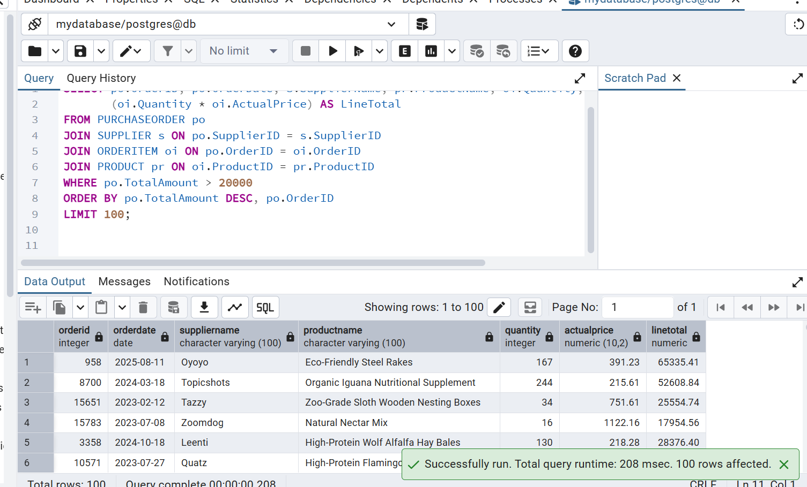


#### שאילתה 7: "פער מחירי קטלוג לעומת רכש בפועל"
**תיאור השאילתא:** מאתרת במדויק מוצרים שהמחיר בו הם נקנו בסוף השורה בפועל (ActualPrice) היה נמוך משמעותית ממחיר הקטלוג המקורי (השגת הנחות!).
```sql
SELECT pr.ProductID, pr.ProductName, pr.UnitPrice AS CatalogPrice, 
       AVG(oi.ActualPrice) AS AvgPurchasePrice, 
       (pr.UnitPrice - AVG(oi.ActualPrice)) AS AverageDiscount
FROM PRODUCT pr
JOIN ORDERITEM oi ON pr.ProductID = oi.ProductID
GROUP BY pr.ProductID, pr.ProductName, pr.UnitPrice
HAVING AVG(oi.ActualPrice) < pr.UnitPrice
ORDER BY AverageDiscount DESC;
```


* 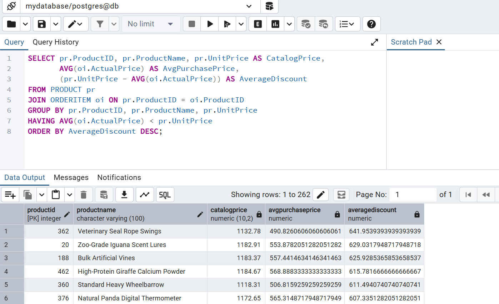


#### שאילתה 8: "תזרים מזומנים - העברות בנקאיות בחצי השנה האחרונה"
**תיאור השאילתא:** מציג למנהלי כספים רק תשלומים שבוצעו בשיטת העברה בנקאית 'Bank Transfer' ורק מחצי השנה האחרונה (התמודדות טבעית עם מאפייני זמן מתגלגלים).
```sql
SELECT p.PaymentID, p.PaymentDate, p.AmountPaid, i.InvoiceID, s.SupplierName
FROM PAYMENT p
JOIN INVOICE i ON p.InvoiceID = i.InvoiceID
JOIN PURCHASEORDER po ON i.OrderID = po.OrderID
JOIN SUPPLIER s ON po.SupplierID = s.SupplierID
WHERE p.PaymentMethod = 'Bank Transfer' 
  AND p.PaymentDate > CURRENT_DATE - INTERVAL '6 months'
ORDER BY p.PaymentDate DESC;
```


* 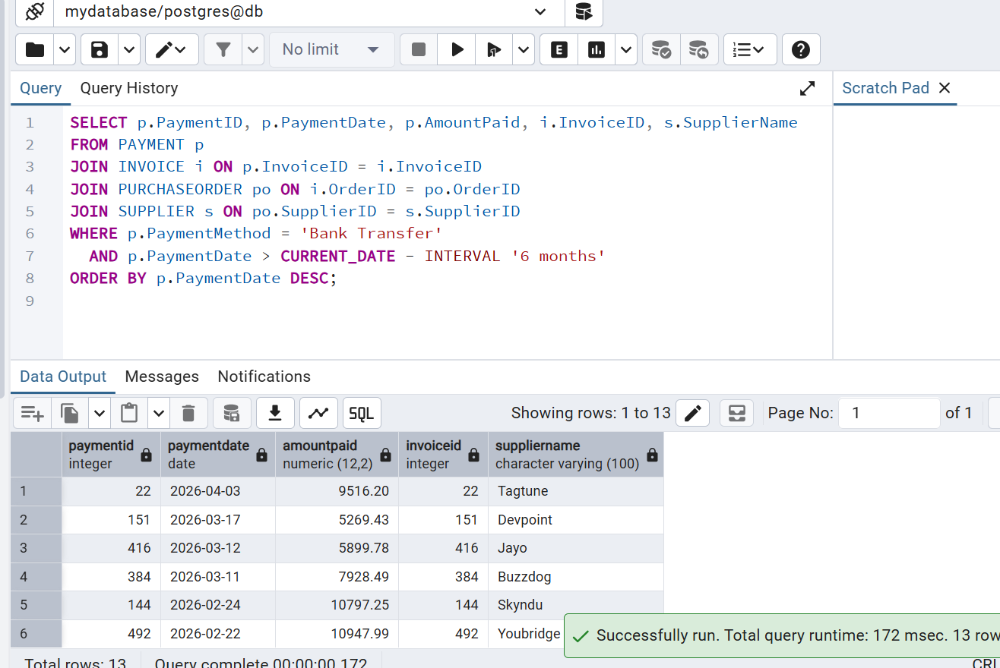


---

## עדכון הנתונים בעומק (UPDATE ו-DELETE)

### שאילתות UPDATE

#### UPDATE 1: "העלאת מחיר ב-15% למוצרים שהוזמנו בכמות גדולה ב-2023"
**תיאור:** מוצרים שהוזמנו ב-2023 בכמויות גדולות (מעל 150 יחידות) מקבלים העלאת מחיר של 15%, משום שהם מוצרי "best seller" המצדיקים מחיר גבוה יותר.

```sql
UPDATE PRODUCT
SET UnitPrice = UnitPrice * 1.15
WHERE ProductID IN (
    SELECT DISTINCT oi.ProductID
    FROM ORDERITEM oi
    JOIN PURCHASEORDER po ON oi.OrderID = po.OrderID
    WHERE oi.Quantity > 150 AND EXTRACT(YEAR FROM po.OrderDate) = 2023
);
```

##### הנתונים לפני העדכון:
* 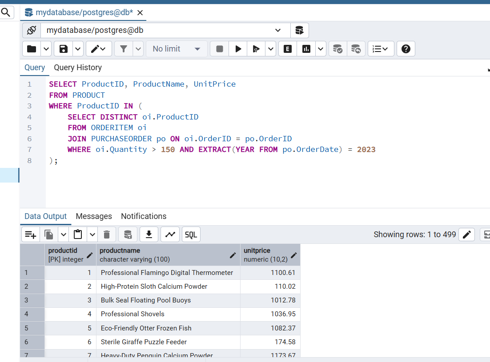

##### ביצוע שאילתת העדכון (UPDATE):
* 

##### הנתונים לאחר העדכון:
* 


#### UPDATE 2: "הפחתת 10% מסך ההזמנות של ספקי Marketing ב-2024"
**תיאור:** כל הזמנות שנרכשו מספקים מקטגוריית "Marketing" בשנת 2024 מקבלות הנחה קבוצתית של 10% על סך ההזמנה.

```sql
UPDATE PURCHASEORDER
SET TotalAmount = TotalAmount * 0.90
WHERE EXTRACT(YEAR FROM OrderDate) = 2024
AND SupplierID IN (
    SELECT SupplierID FROM SUPPLIER WHERE Category = 'Marketing'
);
```

##### הנתונים לפני העדכון:
* 

##### ביצוע שאילתת העדכון (UPDATE):
* 

##### הנתונים לאחר העדכון:
* 

#### UPDATE 3: "הנחת מוצרי Fresh - הורדת מחיר ב-20% להזמנות ביולי-אוגוסט"
**תיאור:** מוצרי "Fresh" שהוזמנו בחודשי קיץ (יולי ואוגוסט) מקבלים הנחה משמעותית של 20% מן המחיר בפועל, משום שהם פגיעים ודורשים מהירות משלוח.

```sql
UPDATE ORDERITEM
SET ActualPrice = ActualPrice * 0.80
WHERE ProductID IN (SELECT ProductID FROM PRODUCT WHERE ProductName LIKE '%Fresh%')
AND OrderID IN (
    SELECT OrderID FROM PURCHASEORDER 
    WHERE EXTRACT(MONTH FROM OrderDate) IN (7, 8)
);
```

##### הנתונים לפני העדכון:
* 

##### ביצוע שאילתת העדכון (UPDATE):
* 

##### הנתונים לאחר העדכון:
* 


### שאילתות DELETE

#### DELETE 1: "ניקוי שגיאות - מחיקת תשלומים שגויים שסכומם נמוך מ-$8000"
**תיאור:** טבלת PAYMENT הוא טבלת "קצה" ללא מפתחות זרים התלויים בה, לכן ניתן למחוק בה בדירוג ישיר. תשלומים בסכומים קטנים מ-$8000 נחשבים לשגיאות במערכת ונמחקים.

```sql
DELETE FROM PAYMENT 
WHERE AmountPaid < 8000;
```

##### הנתונים לפני המחיקה:
* 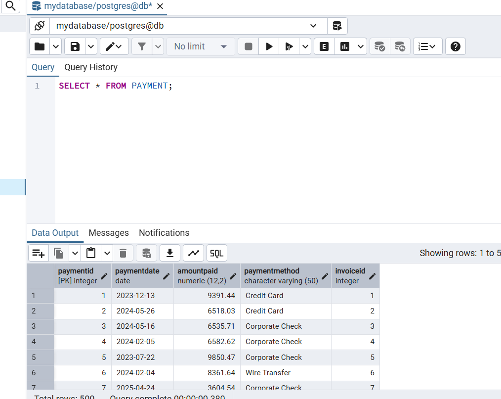

##### ביצוע שאילתת המחיקה (DELETE):
* 

##### הנתונים לאחר המחיקה:
* 

#### DELETE 2: "מחיקת תשלומים בכרטיס אשראי מהחצי הראשון של 2023"
**תיאור:** לצורכי ניקיון היסטוריה, מחקנו את כל התשלומים שבוצעו בכרטיס אשראי (Credit Card) בחצי הראשון של 2023, כשהתשלומים מקושרים להזמנות של אותה תקופה.

```sql
DELETE FROM PAYMENT
WHERE PaymentMethod = 'Credit Card' 
AND InvoiceID IN (
    SELECT i.InvoiceID 
    FROM INVOICE i
    JOIN PURCHASEORDER po ON i.OrderID = po.OrderID
    WHERE EXTRACT(YEAR FROM po.OrderDate) = 2023
    AND EXTRACT(MONTH FROM po.OrderDate) <= 6
);
```

##### הנתונים לפני המחיקה:
* 

##### ביצוע שאילתת המחיקה (DELETE):
* 

##### הנתונים לאחר המחיקה:
* 

#### DELETE 3: "מחיקת שורות הזמנה לא משמעותיות - מוצרי Organic עם כמות נמוכה ב-2023"
**תיאור:** שורות הזמנה קטנות מ-20 יחידות של מוצרי "Organic" מ-2023 נמחקות, משום שהן לא משמעותיות מבחינה כלכלית וגוזלות משאבי אחזוקה במסד.

```sql
DELETE FROM ORDERITEM
WHERE Quantity < 20 
AND ProductID IN (
    SELECT ProductID FROM PRODUCT WHERE ProductName LIKE '%Organic%'
)
AND OrderID IN (
    SELECT OrderID FROM PURCHASEORDER WHERE EXTRACT(YEAR FROM OrderDate) = 2023
);
```


##### הנתונים לפני המחיקה:
* 

##### ביצוע שאילתת המחיקה (DELETE):
* 
* 

##### הנתונים לאחר המחיקה:
* 

---

## אילוצים (Constraints)
**הסברים למילון הנתונים (מוטיבציה ותועלת):**
אילוצים משפרים את אמינות המערכת. אי הוספת אילוץ תאפשר למשתמש להחריב מידע קריטי על ידי הכנסת "זבל" כנתונים פיננסיים אלו.

#### אילוץ 1. מניעת הזנת כמות אפסית או שלילית
אף משתמש לא יכול להזמין מספר פריטים שקטן מ-1.

**הוספת האילוץ:**
```sql
ALTER TABLE ORDERITEM ADD CONSTRAINT chk_quantity_positive CHECK (Quantity > 0);
```
* 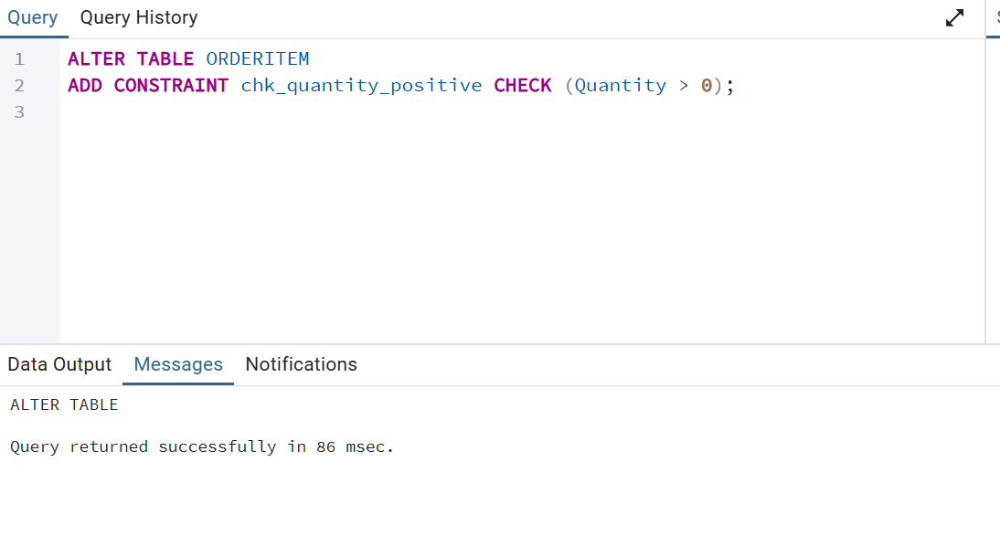

**בדיקת האילוץ (קבלת שגיאה בעת הכנסת נתון לא חוקי):**
* 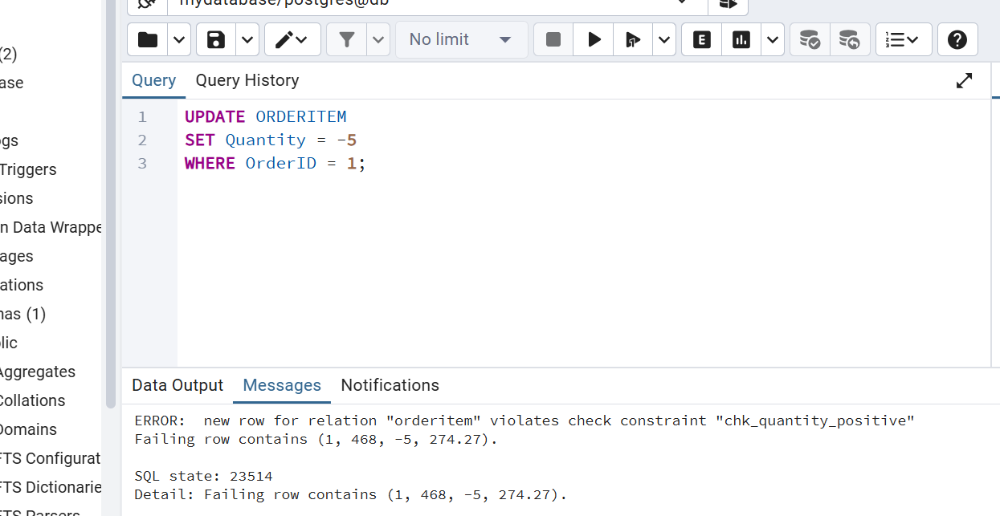

#### אילוץ 2. הגנה על מחירי קטלוג
מוצר לא תומך במחיר שלילי.

**הוספת האילוץ:**
```sql
ALTER TABLE PRODUCT ADD CONSTRAINT chk_price_positive CHECK (UnitPrice >= 0);
```
* 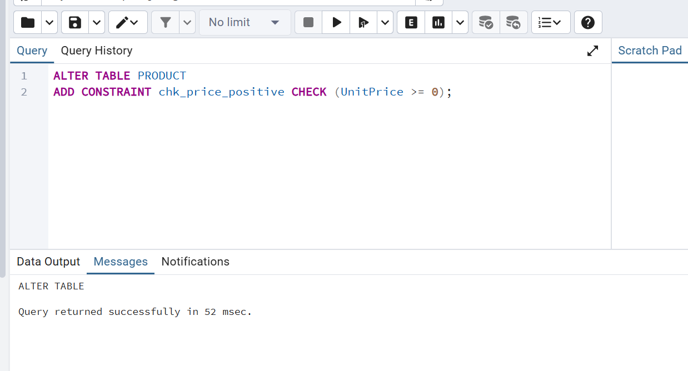

**בדיקת האילוץ (קבלת שגיאה בעת הכנסת נתון לא חוקי):**
* 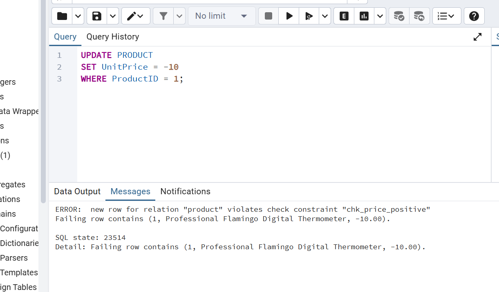

#### אילוץ 3. הגבלת סטטוס הזמנה לרשימה מורשית בלבד
אילוץ המוודא שלא ניתן להזין למערכת סטטוס הזמנה שאינו חוקי (חובה להשתמש בערכים מורשים בלבד).

**הוספת האילוץ:**
```sql
ALTER TABLE PURCHASEORDER ADD CONSTRAINT chk_valid_status CHECK (Status IN ('Pending', 'Approved', 'Delivered', 'Cancelled'));
```
* 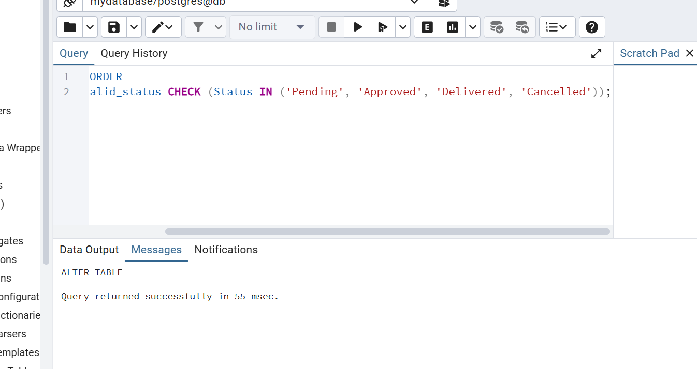

**בדיקת האילוץ (קבלת שגיאה בעת הכנסת נתון לא חוקי):**
* 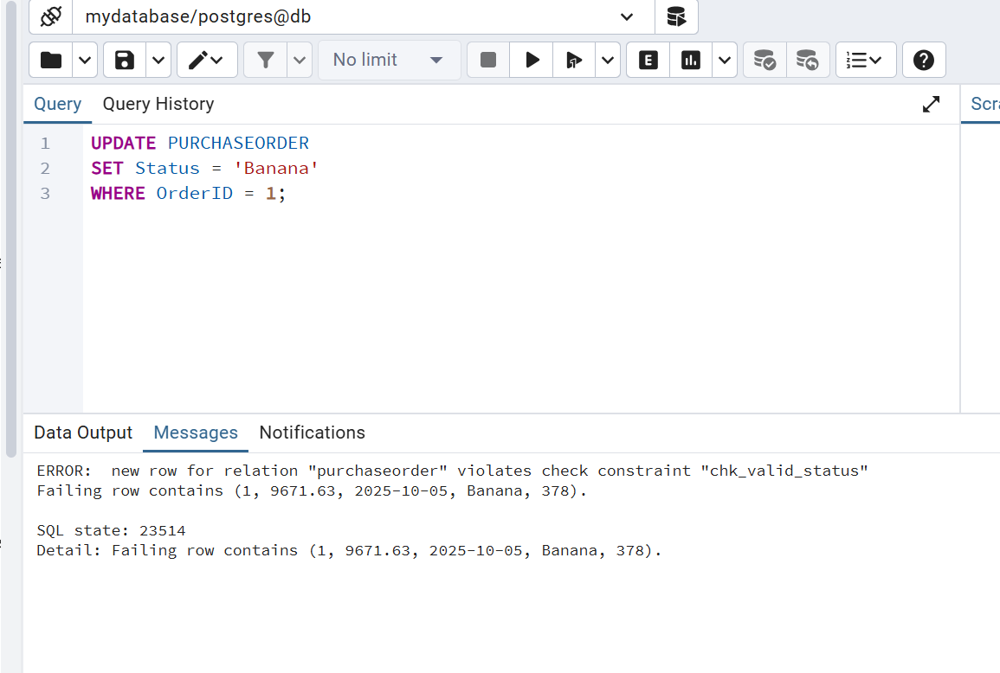

---

## אינדקסים ובדיקת זמני ריצה

**מה זה אומר?** 
אינדקס זה כמו "תוכן עניינים" בספר. במקום שמסד הנתונים יעבור שורה-שורה מתוך 20,000 הזמנות (שזה לוקח המון זמן), הוא קופץ ישר לתוצאה. הפקודה `EXPLAIN ANALYZE` אומרת למערכת: "אל תביאי לי רק את התוצאה, תגידי לי גם כמה אלפיות-שנייה (ms) לקח לך למצוא אותה".

להלן 3 אינדקסים שנוצרו במערכת והוכחת היעילות שלהם:

### 1. אינדקס על תאריך ההזמנה (`OrderDate`)
אינדקס זה נועד להאיץ שאילתות שמחפשות הזמנות לפי טווח תאריכים.

##### הרצה ראשונה (זמן ביצוע ארוך):
שאילתת EXPLAIN ANALYZE שרצה בשיטת "Seq Scan" (סריקה איטית שורה-שורה).
* 

##### פעולת יצירת האינדקס:
```sql
CREATE INDEX idx_order_date ON PURCHASEORDER(OrderDate);
```
* 

##### הרצה שנייה (זמן קצר):
ניתן לראות שה-Execution Time צנח משמעותית והמערכת משתמשת ב-"Index Scan" (סריקה מהירה על בסיס האינדקס שיצרנו).
* 


### 2. אינדקס על מפתח זר לשם ספק (`SupplierID` בהזמנות)
מסייע בהצלבות נתונים במקרים של חיפוש כל ההזמנות ששייכות לספק מסוים. ללא אינדקס, חיבור ספק לעשרות אלפי הזמנות דורש סריקה מלאה של כל הטבלה.

##### הרצה ראשונה (זמן ביצוע ארוך):
* 

##### פעולת יצירת האינדקס:
```sql
CREATE INDEX idx_fk_supplier ON PURCHASEORDER(SupplierID);
```
* 

##### הרצה שנייה (זמן קצר):
ה-Execution Time צונח והמערכת מבצעת "Index Scan".
* 


### 3. אינדקס הצרנה של שם המוצר (`ProductName` בקטלוג המוצרים)
אינדקס שנועד לזרז חיפושים טקסטואליים של שמות מוצרים במערכת.

##### הרצה ראשונה (זמן ביצוע ארוך):
* 

##### פעולת יצירת האינדקס:
```sql
CREATE INDEX idx_product_name ON PRODUCT(ProductName);
```
* 

##### הרצה שנייה (זמן קצר):
שליפה מהירה הרבה יותר דרך האינדקס המיועד.
* 

---

## טרנזקציות: ROLLBACK לעומת COMMIT

### טעות הרסנית ופעולת הצלה (ROLLBACK)
1. נפתחת בועת טרנזקציה `BEGIN;`. 
2. מתרחש עדכון כושל שמכפיל את מחירי המוצרים בקטלוג פי 100:
```sql
UPDATE PRODUCT SET UnitPrice = UnitPrice * 100;
```

##### ביצוע העדכון השגוי (UPDATE):
* 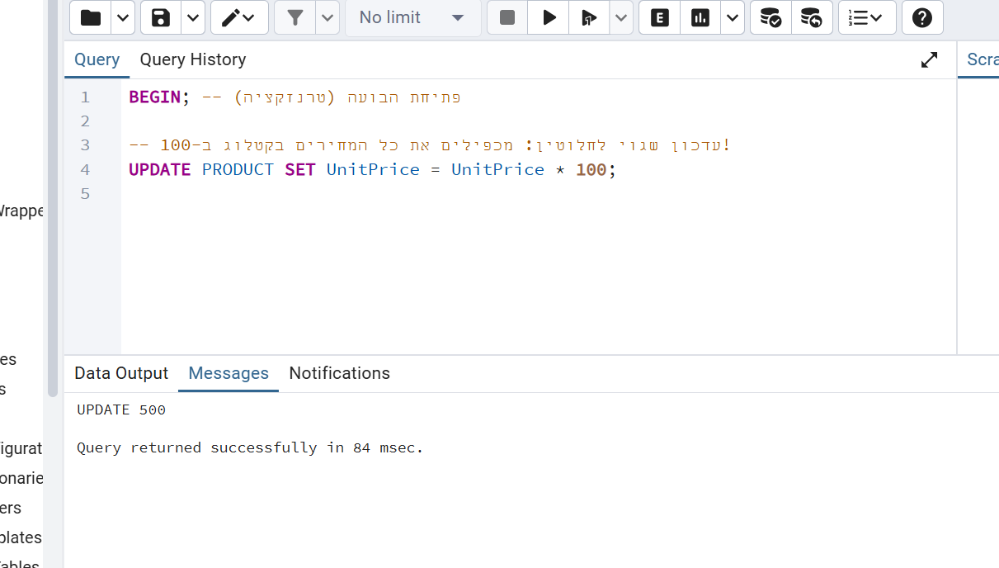

3. המציאות נראית שחורה - בדיקת המחירים מראה שהכל הוכפל:
```sql
SELECT ProductID, ProductName, UnitPrice FROM PRODUCT LIMIT 5;
```

##### הצגת הנתונים לאחר העדכון ההרסני (SELECT):
* 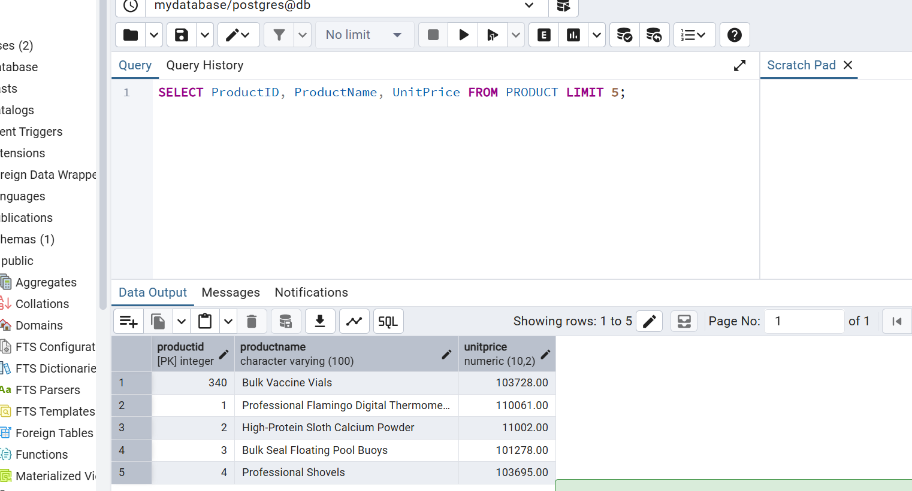

4. ביטול מהיר באמצעות `ROLLBACK;`. כל היסטוריית העדכון נמחקת ולא נכתבת לקשיח.

##### ביצוע פקודת הביטול (ROLLBACK):
* 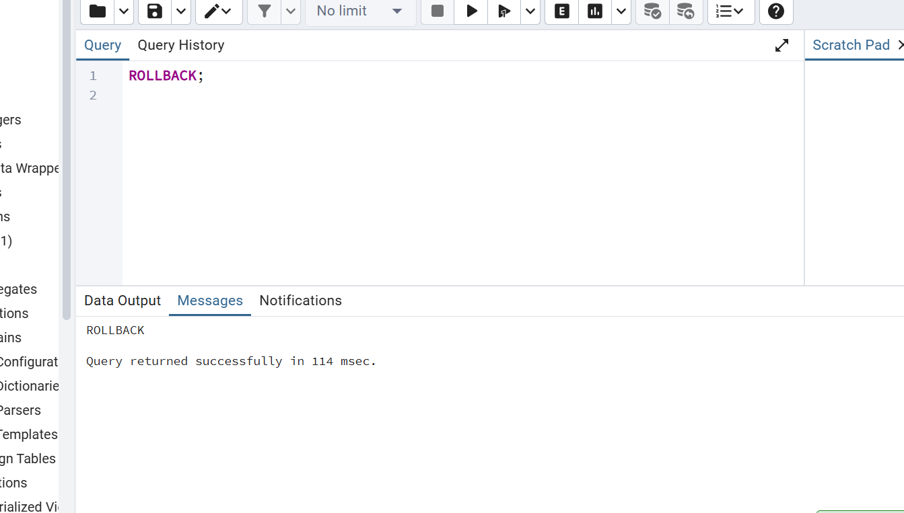

5. הצגת מצב מסד הנתונים לאחר פעולת הביטול (המחירים חזרו להיות תקינים):
```sql
SELECT ProductID, ProductName, UnitPrice FROM PRODUCT LIMIT 5;
```

##### הצגת הנתונים לאחר ביטול העדכון (SELECT):
* 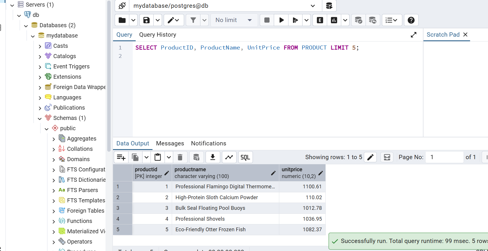

### עדכון תקין ואישור סופי (COMMIT)
1. כניסה לתצורה של טרנזקציה חדשה על ידי `BEGIN;`.
2. מבצעים עדכון תקין - משנים את הסטטוס של הזמנה מספר 1 ל-'Delivered':
```sql
UPDATE PURCHASEORDER SET Status = 'Delivered' WHERE OrderID = 1;
```

##### ביצוע העדכון התקין (UPDATE):
* 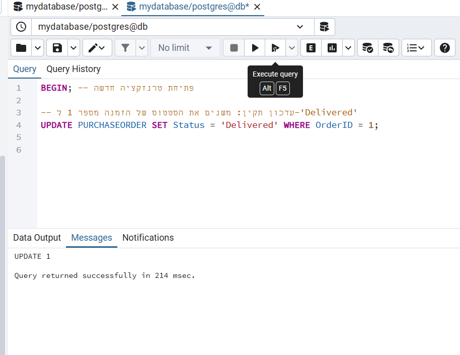

3. עורכים בדיקת תקינות על הנתונים (בתוך הטרנזקציה טרם שמירה סופית):
```sql
SELECT OrderID, Status FROM PURCHASEORDER WHERE OrderID = 1;
```

##### הצגת הנתונים לפני השמירה הסופית (SELECT):
* 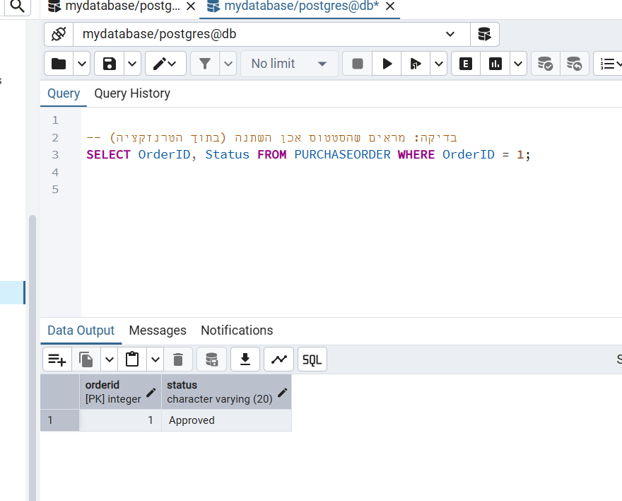

4. הפעולה נמצאה תקינה, לכן מאשרים את שמירת הנתונים לתמיד עם `COMMIT;`. עכשיו המידע חתום במסד הנתונים.

##### ביצוע פקודת האישור (COMMIT):
* 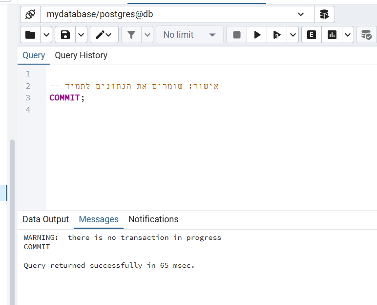

5. הנתונים זמינים באופן קבוע: מוכיחים שהסטטוס נשמר בצורה תקינה וסופית לכלל המשתמשים.
```sql
SELECT OrderID, Status FROM PURCHASEORDER WHERE OrderID = 1;
```

##### הצגת הנתונים לאחר השמירה (SELECT):
* 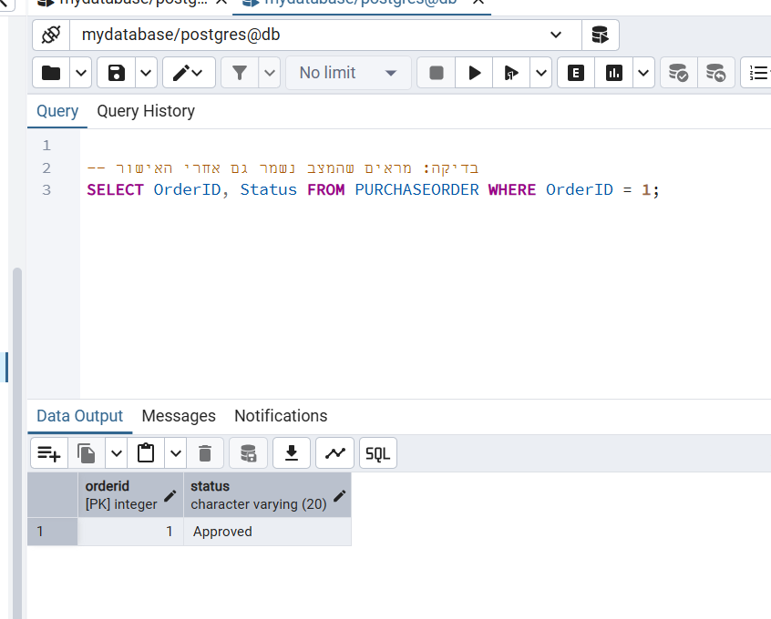
